# Z407 Controller Code Flow Documentation

This document provides comprehensive code flow diagrams to help you understand how the Z407 ESPHome component works. It covers the entire lifecycle from configuration to runtime operation.

## Table of Contents

1. [Architecture Overview](#1-architecture-overview)
2. [Configuration to Code Generation Flow](#2-configuration-to-code-generation-flow)
3. [BLE Connection Lifecycle](#3-ble-connection-lifecycle)
4. [Handshake Sequence](#4-handshake-sequence)
5. [Command Execution Flow](#5-command-execution-flow)
6. [State Management](#6-state-management)
7. [Platform Components](#7-platform-components)
8. [Discovery Mode](#8-discovery-mode)
9. [Input Source Switching](#9-input-source-switching)
10. [Error Handling & Recovery](#10-error-handling--recovery)

---

## 1. Architecture Overview

The Z407 Controller is an ESPHome custom component that bridges an ESP32 with Home Assistant to control Logitech Z407 Bluetooth speakers via BLE.

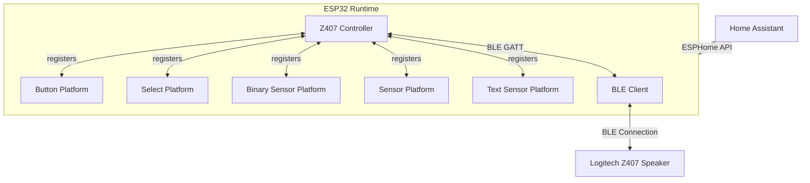

### Key Components

| Component | Purpose |
|-----------|---------|
| `Z407Controller` | Main component - manages BLE connection, handshake, and state |
| `BLEClient` | ESPHome's BLE client component that handles low-level BLE |
| `Button` | Individual button entities for each command |
| `Select` | Input source selector (Bluetooth/AUX/USB) |
| `BinarySensor` | Connection status indicator |
| `Sensor` | RSSI signal strength |
| `TextSensor` | Discovery result display |

---

## 2. Configuration to Code Generation Flow

ESPHome uses Python code generators to create C++ code from YAML configuration. This diagram shows how your `z407_basic.yaml` becomes running firmware.

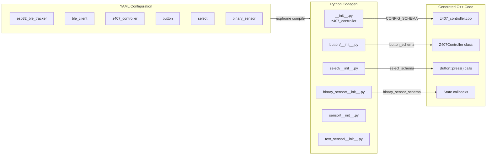

### Configuration Validation Flow

When you compile, ESPHome validates your YAML against the `CONFIG_SCHEMA` defined in Python:

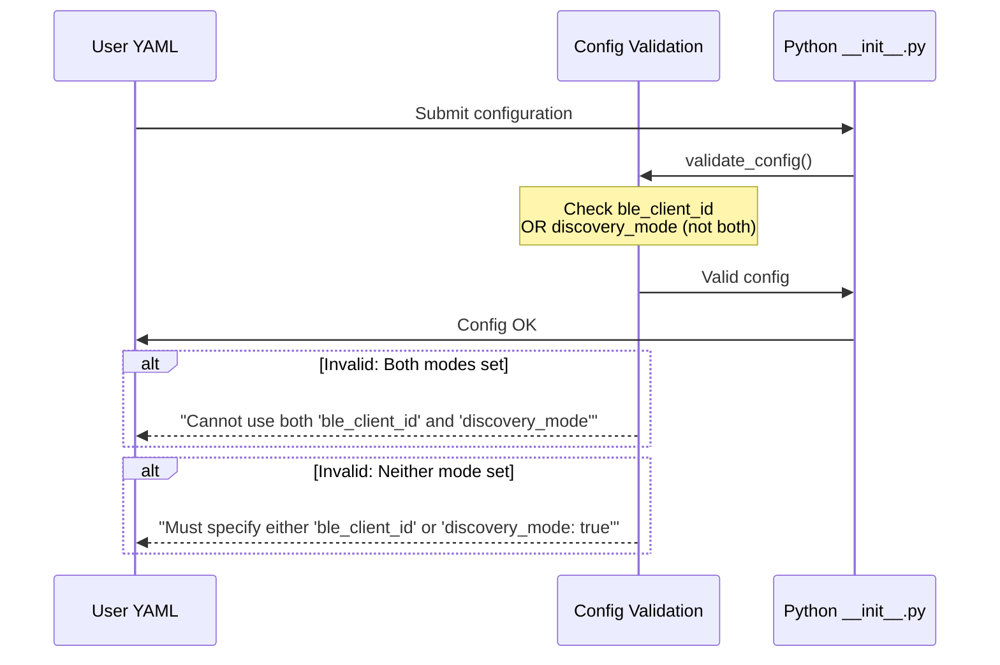

### Key Configuration Options

| Option | Type | Default | Description |
|--------|------|---------|-------------|
| `ble_client_id` | ID | Required* | Reference to ble_client component |
| `discovery_mode` | boolean | false | Enable MAC address discovery |
| `discovery_duration` | time | 30s | How long to scan for device |
| `connection_timeout` | time | 30s | Handshake timeout |
| `auto_reconnect` | boolean | true | Auto-reconnect on disconnect |

*One of `ble_client_id` or `discovery_mode` is required.

---

## 3. BLE Connection Lifecycle

This diagram shows the complete lifecycle of a BLE connection from initial setup to ready state.

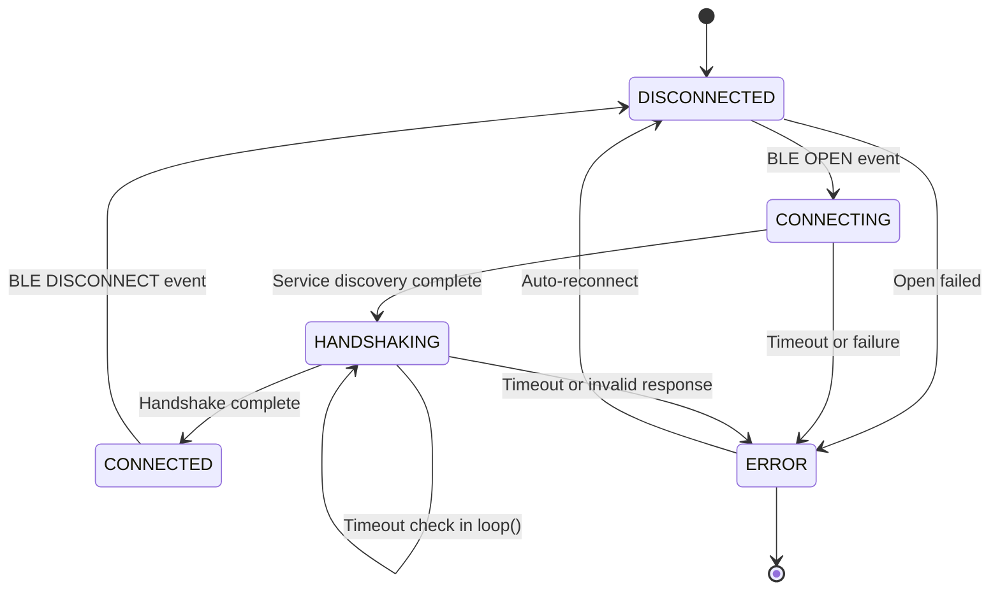

### BLE Event Handler Flow

The `gattc_event_handler` processes all BLE events from ESP32's BLE stack:

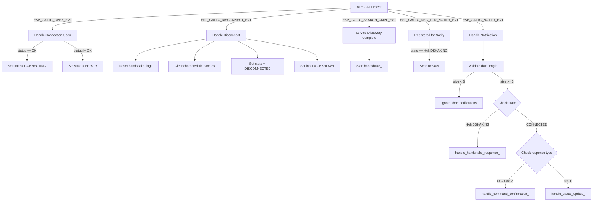

### Characteristic Discovery Flow

After BLE connection, the component discovers the Z407's GATT service and characteristics:

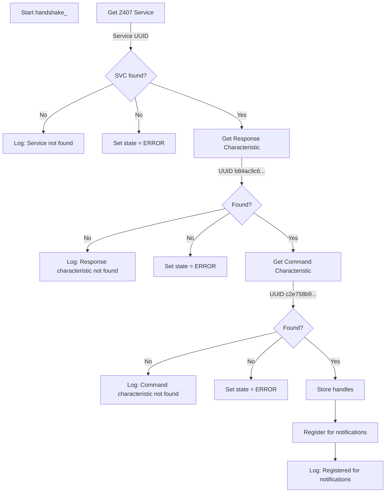

**Service UUID:** `0000fdc2-0000-1000-8000-00805f9b34fb`
**Command Characteristic:** `c2e758b9-0e78-41e0-b0cb-98a593193fc5` (write)
**Response Characteristic:** `b84ac9c6-29c5-46d4-bba1-9d534784330f` (notify)

---

## 4. Handshake Sequence

The Z407 requires a specific handshake to establish a valid communication session. This is a critical flow.

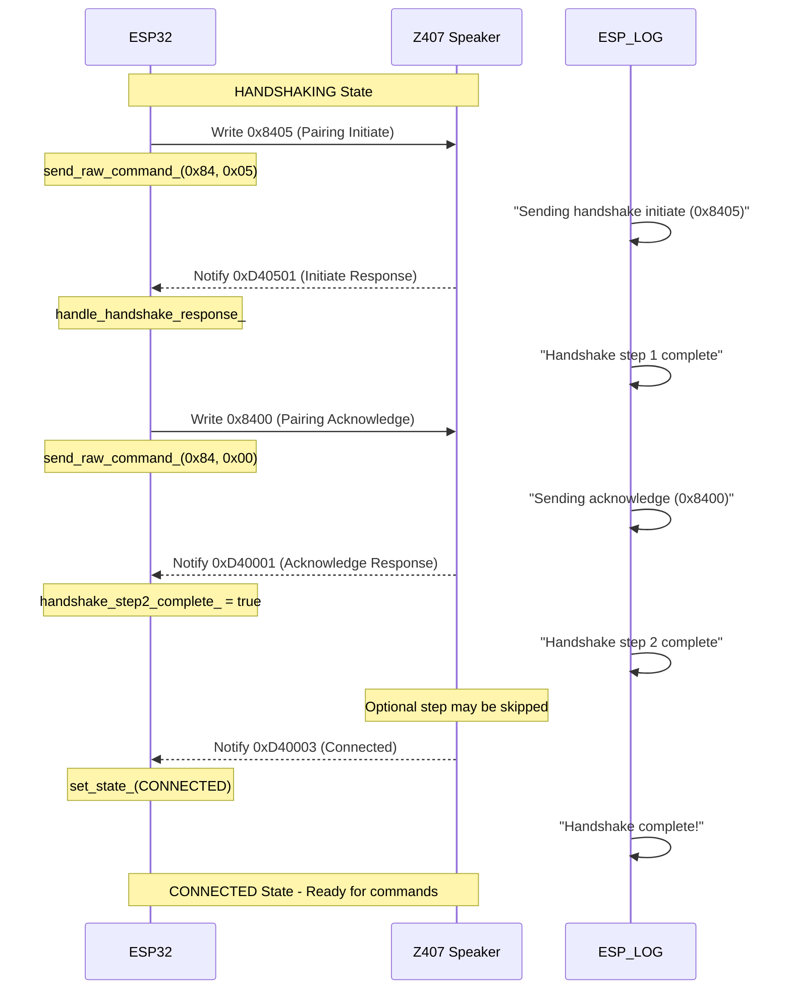

### Handshake Response Handler

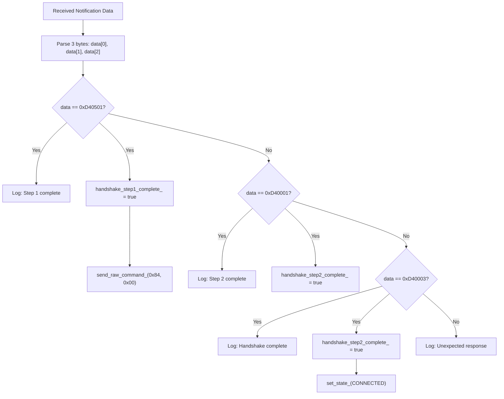

### Command Readiness Check

Before sending any command, the component verifies it's ready:

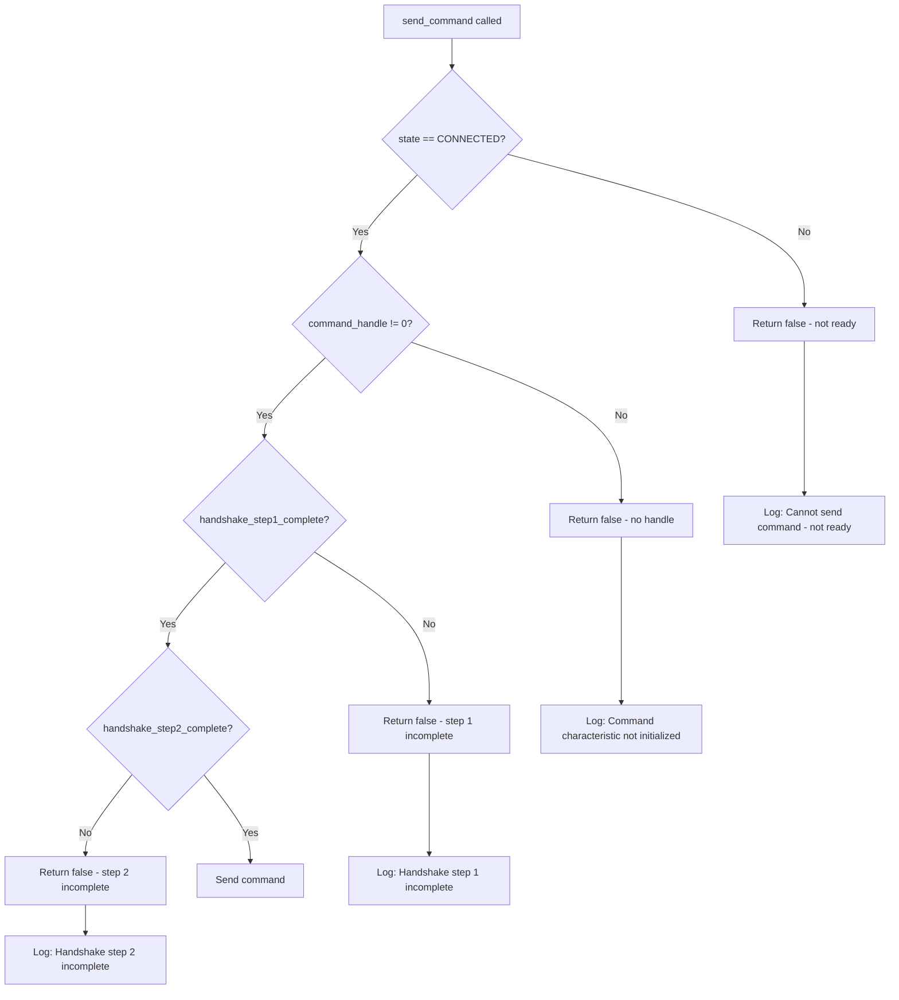

---

## 5. Command Execution Flow

### Button Press to Command

When you press a button in Home Assistant, this flow executes:

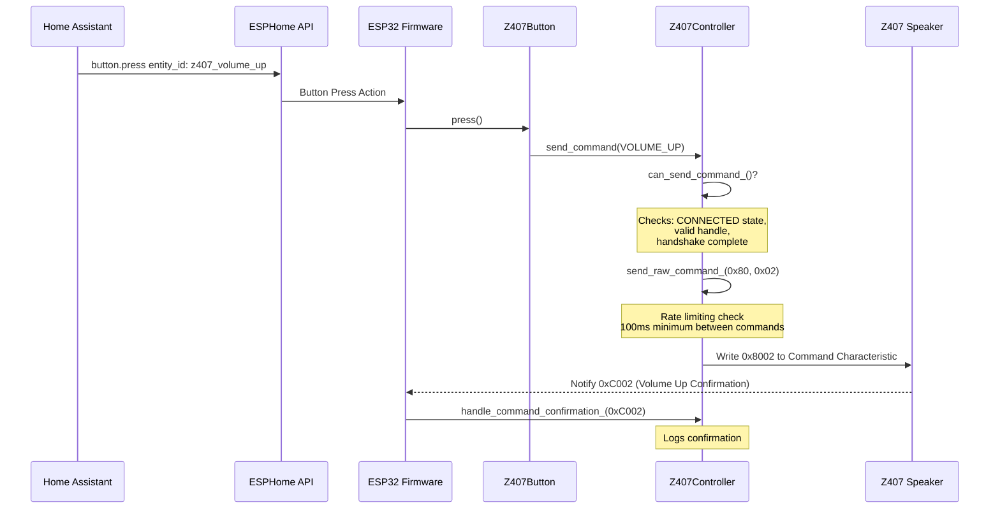

### Command Rate Limiting

Commands are rate-limited to prevent overwhelming the Z407:

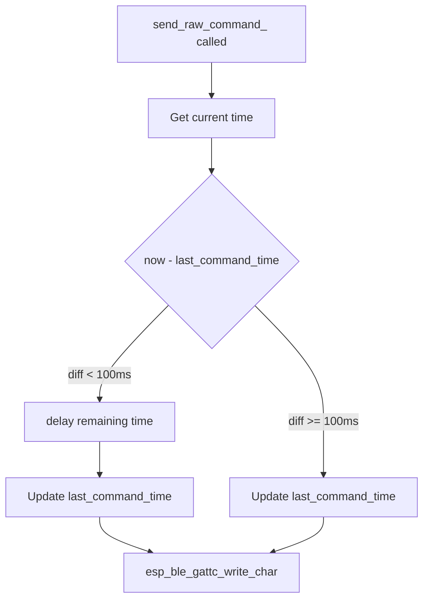

### Command to Hex Mapping

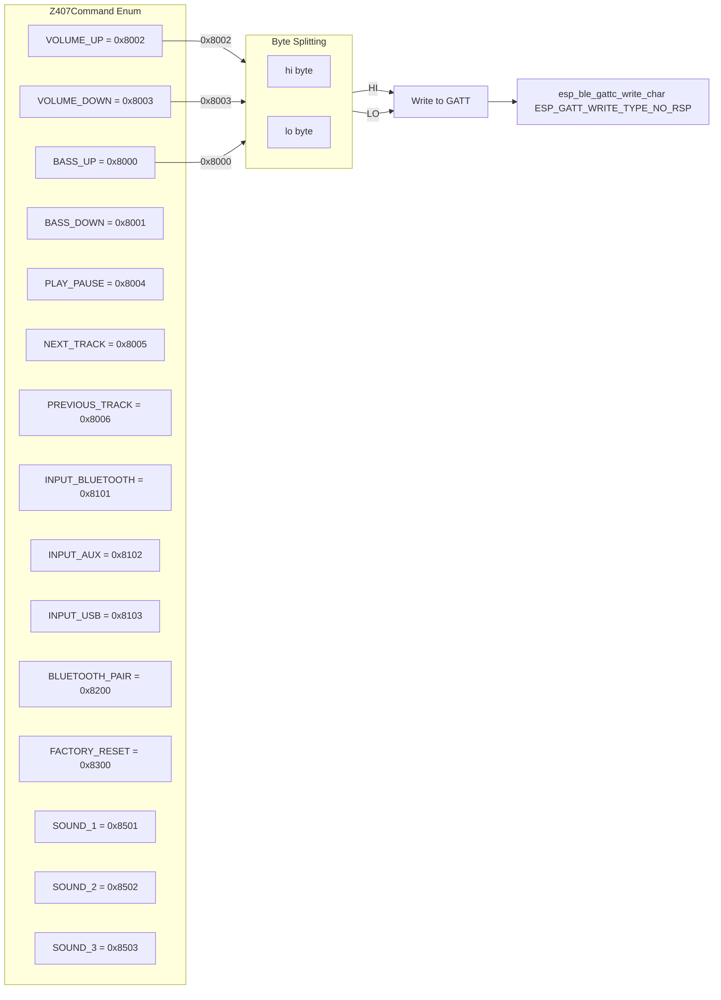

---

## 6. State Management

### State Machine

The component maintains two primary state machines:

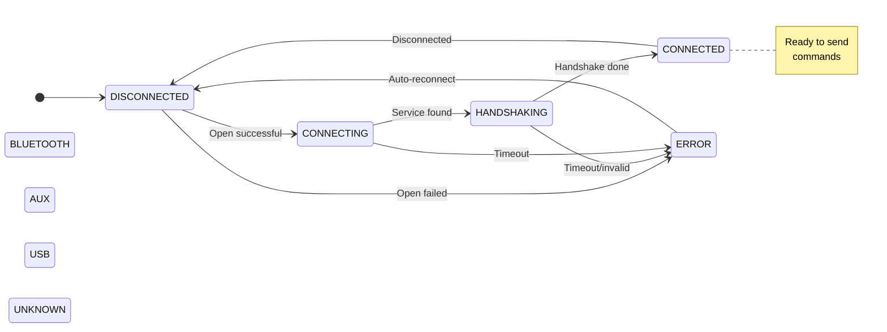

### State Change Callback Flow

When state changes, registered callbacks are notified:

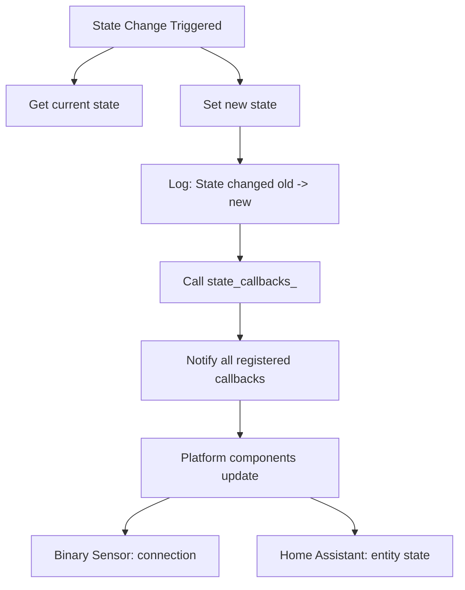

### Registered Platform Components

Platform components register themselves with the controller:

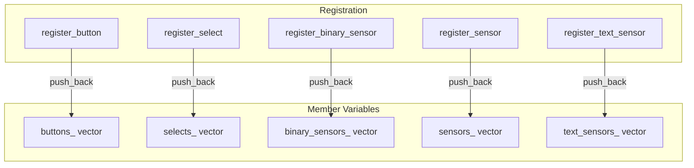

---

## 7. Platform Components

### Button Platform

Buttons provide individual controls for each Z407 command:

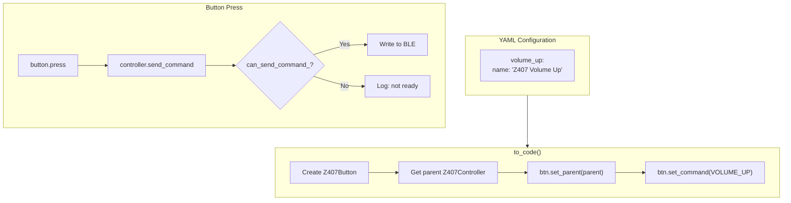

### Select Platform (Input Source)

The select platform allows choosing between Bluetooth, AUX, and USB:

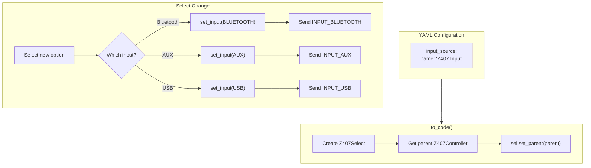

### Input Selection Mapping

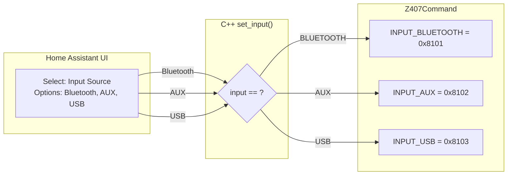

### Binary Sensor (Connection Status)

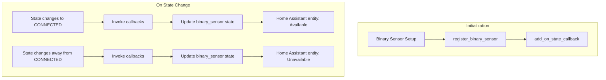

---

## 8. Discovery Mode

Discovery mode helps find the Z407's MAC address without external tools:

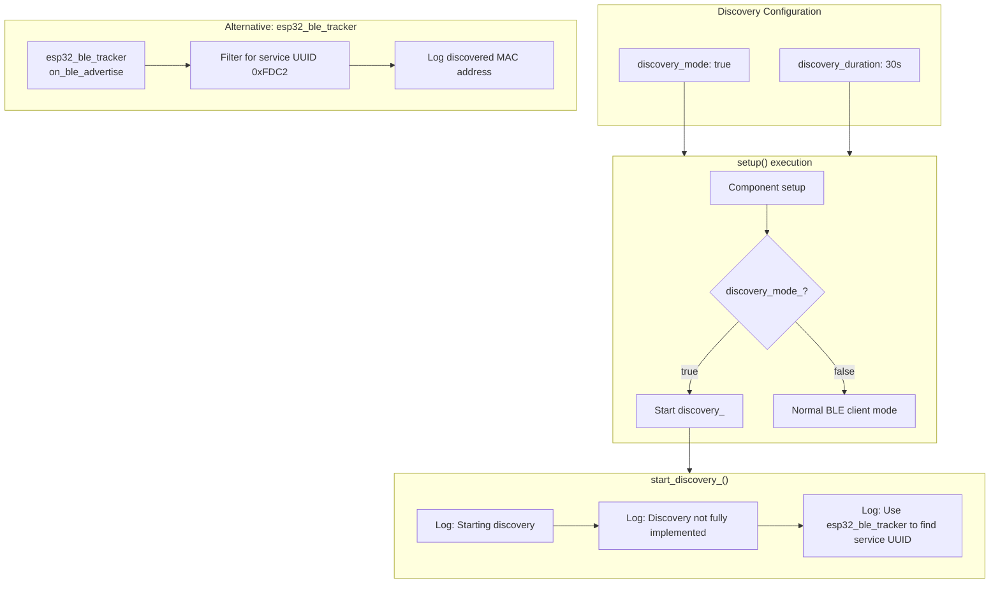

### Discovery Using esp32_ble_tracker

The `z407_discovery.yaml` example uses `esp32_ble_tracker` with a lambda filter:

```mermaid
flowchart TD
    subgraph Scan["BLE Scanning"]
        SCAN[esp32_ble_tracker active scan]
        SCAN --> ADVERTISE[on_ble_advertise event]
    end
    
    subgraph Filter["Lambda Filter"]
        CHECK_SVC[Get service_uuids]
        CHECK_SVC --> LOOP[For each service UUID]
        LOOP --> CMP{UUID == 0xFDC2?}
        
        CMP -->|Match| FOUND_Z407[Z407 Found!]
        CMP -->|No Match| NEXT[Continue scanning]
        
        FOUND_Z407 --> LOG_BOX[Log formatted MAC box]
        LOG_BOX --> STORE[Store z407_mac]
    end
    
```

---

## 9. Input Source Switching

### Input Source Response Handling

When the Z407 changes input source, it sends a notification:

```mermaid
sequenceDiagram
    participant Z407 as Z407 Speaker
    participant CTRL as Z407Controller
    participant LOG as Logs
    
    Note over Z407: User presses input button<br/>on physical remote
    Z407-->>CTRL: Notify 0xCF04/05/06
    
    CTRL->>CTRL: handle_status_update_
    Note over CTRL: data[0] = 0xCF<br/>data[1] = status code
    
    alt data[1] == 0x04
        CTRL->>LOG: "Input switched to Bluetooth"
        CTRL->>CTRL: set_input_(BLUETOOTH)
    else data[1] == 0x05
        CTRL->>LOG: "Input switched to AUX"
        CTRL->>CTRL: set_input_(AUX)
    else data[1] == 0x06
        CTRL->>LOG: "Input switched to USB"
        CTRL->>CTRL: set_input_(USB)
    end
    
    Note over CTRL: input_callbacks_.call(input)
    Note over CTRL: Home Assistant updates<br/>select entity display
```

### Command Confirmation vs Status Update

The Z407 sends two types of responses:

```mermaid
flowchart TD
    RECV[Received Notification]
    RECV --> CHECK1{"data[0] >= 0xC0 AND data[0] <= 0xC5?"}
    
    CHECK1 -->|Yes, Command Confirm| CONFIRM[handle_command_confirmation_]
    CONFIRM --> LOG_C["Log: Command confirmed"]
    CONFIRM --> UPDATE{Update input state?}
    UPDATE -->|0xC101| SET_BT["set_input_(BLUETOOTH)"]
    UPDATE -->|0xC102| SET_AUX["set_input_(AUX)"]
    UPDATE -->|0xC103| SET_USB["set_input_(USB)"]
    UPDATE -->|Other| IGNORE[No state change]
    
    CHECK1 -->|No| CHECK2{"data[0] == 0xCF?"}
    
    CHECK2 -->|Yes, Status Update| STATUS[handle_status_update_]
    STATUS --> LOG_S["Log: Status update"]
    STATUS --> PARSE{Parse status code}
    PARSE -->|0xCF04| SB["set_input_(BLUETOOTH)"]
    PARSE -->|0xCF05| SA["set_input_(AUX)"]
    PARSE -->|0xCF06| SU["set_input_(USB)"]
    
    CHECK1 -->|No| IGNORE2[Unknown, ignore]
    
```

---

## 10. Error Handling & Recovery

### Timeout Handling During Handshake

The `loop()` function monitors handshake timeout:

```mermaid
flowchart TD
    LOOP["loop() called<br/>every iteration"]
    LOOP --> CHECK{hs_state == HANDSHAKING?}
    
    CHECK -->|No| EXIT[Return]
    CHECK -->|Yes| CHECK_TIME{"now - connection_start_time > connection_timeout?"}
    
    CHECK_TIME -->|No| EXIT
    CHECK_TIME -->|Yes| TIMEOUT[Handle timeout]
    TIMEOUT --> LOG_W["Log: Handshake timeout"]
    TIMEOUT --> SET_ERR["set_state_(ERROR)"]
    
```

### Disconnect Handling

```mermaid
flowchart TD
    DISC[ESP_GATTC_DISCONNECT_EVT]
    DISC --> RESET[Reset handshake state]
    RESET --> RESET1[handshake_step1_complete_ = false]
    RESET --> RESET2[handshake_step2_complete_ = false]
    RESET --> RESET3[command_handle_ = 0]
    RESET --> RESET4[response_handle_ = 0]
    
    RESET --> STATE["set_state_(DISCONNECTED)"]
    RESET --> INPUT["set_input_(UNKNOWN)"]
    
    STATE --> RECONNECT{auto_reconnect_?}
    
    RECONNECT -->|Yes| LOG_R["Reconnect handled by BLE client"]
    RECONNECT -->|No| EXIT_D
    
    LOG_R --> EXIT_D[Exit handler]
    
```

### Auto-Reconnect Flow

```mermaid
flowchart TB
    subgraph BLEClient["ESPHome ble_client Component"]
        direction TB
        AUTO["auto_connect: true"]
        AUTO --> LISTEN[Listen for disconnect]
        LISTEN --> WAIT[Wait for Z407 advertisement]
        WAIT --> RECONNECT[Auto-connect]
    end
    
    subgraph Controller["Z407Controller"]
        direction TB
        SCHEDULE[schedule_reconnect_]
        SCHEDULE --> LOG_RC["Log: Reconnect will be handled by BLE client"]
    end
    
    RECONNECT -->|Connection opens| OPEN[ESP_GATTC_OPEN_EVT]
    OPEN -->|success| HANDSHAKE[Start handshake_]
    
```

---

## Quick Reference: Common Debugging Scenarios

### "Cannot send command - not ready" Error

This error means `can_send_command_()` returned false. Check:

1. **State**: Is `state_ == CONNECTED`? Check logs for "State changed: X -> Connected"
2. **Handles**: Is `command_handle_ != 0`? (Should be set after service discovery)
3. **Handshake**: Are both `handshake_step1_complete_` and `handshake_step2_complete_` true?

### Handshake Never Completes

Check for:
1. Z407 already connected to another device (remove remote batteries)
2. Wrong MAC address in configuration
3. Z407 not powered on or not in pairing mode
4. Connection timeout too short (try 60s)

### Unexpected Handshake Responses

The Z407 may send responses in different orders. The handler accepts:
- `0xD40501` → Step 1 response to `0x8405`
- `0xD40001` → Step 2 response to `0x8400` (may be skipped)
- `0xD40003` → Connection established

### Commands Rate Limited

If commands seem delayed, check:
- 100ms minimum between commands (`COMMAND_DELAY_MS`)
- Multiple rapid button presses will queue with delays

---

## File Structure Reference

```
components/z407_controller/
├── __init__.py              # Python config schema, to_code(), actions
├── z407_controller.h        # C++ class declarations, enums
├── z407_controller.cpp     # C++ implementation, BLE event handling
├── button/__init__.py       # Button platform codegen
├── select/__init__.py       # Select platform codegen
├── binary_sensor/__init__.py # Binary sensor platform codegen
├── sensor/__init__.py       # Sensor platform codegen
└── text_sensor/__init__.py # Text sensor platform codegen
```

### Key Files and Their Responsibilities

| File | Responsibility |
|------|---------------|
| `__init__.py` | Configuration validation, code generation entry points |
| `z407_controller.h` | Class definition, enums, constants |
| `z407_controller.cpp` | Runtime logic: BLE events, handshake, commands |
| `button/__init__.py` | Generate button entities from YAML |
| `select/__init__.py` | Generate select entity for input switching |

---

## Understanding the BLE Protocol

For detailed protocol information, see the reverse-engineering documentation:

- [Original Protocol Documentation](../logi-z407-reverse-engineering/doc/Protocol.md)
- [Reverse Engineering Notes](../logi-z407-reverse-engineering/doc/ReverseEngineering.md)

### Service and Characteristic UUIDs

| Type | UUID |
|------|------|
| Service | `0000fdc2-0000-1000-8000-00805f9b34fb` |
| Command Characteristic | `c2e758b9-0e78-41e0-b0cb-98a593193fc5` |
| Response Characteristic | `b84ac9c6-29c5-46d4-bba1-9d534784330f` |

---

*This documentation was generated to help maintain the Z407 ESPHome component. For questions or clarifications, please refer to the codebase or open an issue.*